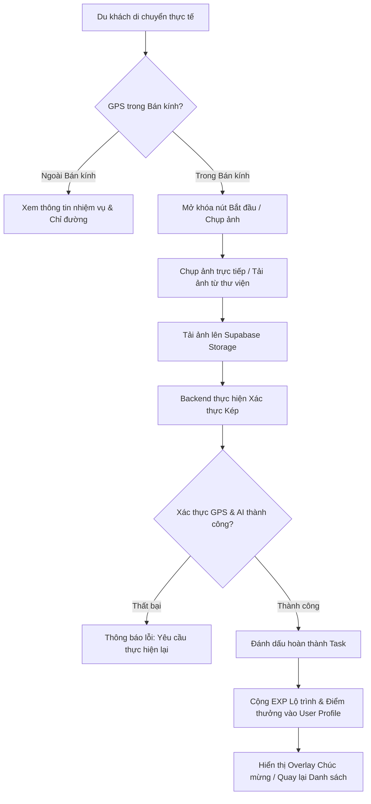

# KIẾN TRÚC HỆ THỐNG GAMIFICATION - SMART TOURISM SYSTEM
*(Dành cho Đồ án Tốt nghiệp / Demo Production-Lite)*

Tài liệu này đặc tả chi tiết kiến trúc của module **Gamification**, tập trung chính vào **Màn hình Chi tiết Nhiệm vụ (Task Detail Screen)** và **Luồng Xác thực Ảnh chụp bằng AI kết hợp định vị GPS**.

---

## 1. TỔNG QUAN LUỒNG HOẠT ĐỘNG (END-TO-END WORKFLOW)

Hệ thống hoạt động theo một vòng lặp khép kín (Gamification Loop) giúp tăng trải nghiệm tương tác của du khách:



---

## 2. THIẾT KẾ UX/UI CẢM HỨNG GAME (MOBILE-FIRST)

Để mang lại cảm giác "chơi game" như **Pokémon GO** hay **Duolingo**, giao diện cần sử dụng gam màu sống động, chế độ bo góc mềm mại, đổ bóng sâu (glassmorphism) và các hiệu ứng chuyển động mượt mà.

### Màn hình 1: Location Task Drawer / Popup (Danh sách nhiệm vụ tại địa điểm)
*   **Banner**: Ảnh nổi bật của địa điểm du lịch kèm một lớp phủ gradient tối dần xuống dưới.
*   **Quick Stats**: Hiển thị khoảng cách thực tế (ví dụ: `📍 Cách bạn 35m`) kèm vòng tròn chỉ thị GPS (Màu xanh: Hợp lệ để làm nhiệm vụ | Màu cam: Quá xa).
*   **Danh sách Task**: Thiết kế dạng Card dẹt, bo tròn 16px:
    *   *Chưa làm*: Viền xám nhạt, nút "Bắt đầu" màu cam sáng hoặc xanh lục neon.
    *   *Đang làm*: Viền nét đứt màu vàng hổ phách kèm tiến trình `[ 🏃 Đang thực hiện ]`.
    *   *Đã hoàn thành*: Màu nền chuyển sang xanh lục pastel, có dấu tích vàng óng ánh và ghi `+150 EXP (Đã nhận)`.

### Màn hình 2: Task Detail Screen (Trọng tâm)
*   **Header**: Thanh bar mờ trong suốt (Blur backdrop) chứa nút Back kiểu mũi tên mềm và tiêu đề nhiệm vụ tinh gọn.
*   **Card Chi tiết**:
    *   **EXP Badge**: Huy hiệu lục giác chứa số EXP thưởng, thiết kế nổi 3D ánh kim vàng.
    *   **Độ khó (Difficulty)**: Gồm 3 cấp độ (Dễ - 🟢 | Trung bình - 🟡 | Khó - 🔴).
    *   **Hướng dẫn chi tiết**: Hướng dẫn du khách góc chụp lý tưởng (ví dụ: *"Chụp toàn cảnh mặt trước của tượng Chúa dang tay, lấy được cả nền trời xanh"*).
*   **Thành phần Bản đồ & GPS (Mini Map)**:
    *   Bản đồ nhỏ chiếm 30% chiều cao màn hình (sử dụng Mapbox hoặc Google Maps gọn nhẹ).
    *   Đường nét đứt màu xanh nối từ chấm tròn của User (nhấp nháy) đến biểu tượng Flag/Pin của địa điểm du lịch.
    *   Thanh trạng thái GPS thời gian thực: `📡 Độ chính xác: Cao (~4m) | Khoảng cách: 12m (Trong bán kính hợp lệ)`.
*   **Khu vực Tương tác (Camera & Upload)**:
    *   Nếu ngoài bán kính: Nút "Chụp ảnh" bị vô hiệu hóa (disabled), hiển thị thông điệp gợi ý *"Hãy di chuyển lại gần thêm 35m để mở khóa camera"*.
    *   Nếu trong bán kính: Nút "Chụp ảnh" nhấp nháy hiệu ứng sóng (ripple effect), thúc giục nhấn vào.
    *   Mở trình chụp ảnh chuyên nghiệp trên Mobile hoặc hiển thị giao diện Camera Viewfinder giả lập trực tiếp trên web với nút chụp hình lớn hình tròn.

---

## 3. THIẾT KẾ DATABASE SCHEMA (SUPABASE / POSTGRESQL)

Dưới đây là thiết kế chi tiết tích hợp hoàn hảo với các bảng hiện có của bạn (như `locations`, `users`, `itineraries`).

### 3.1. Script PostgreSQL DDL (Chạy trực tiếp trên Supabase SQL Editor)

```sql
-- 1. ENUMS cho Gamification
CREATE TYPE task_type_enum AS ENUM ('PHOTO', 'CHECKIN', 'QUIZ');
CREATE TYPE task_difficulty_enum AS ENUM ('EASY', 'MEDIUM', 'HARD');
CREATE TYPE submission_status_enum AS ENUM ('PENDING', 'APPROVED', 'REJECTED');
CREATE TYPE progress_status_enum AS ENUM ('IN_PROGRESS', 'COMPLETED');

-- 2. BẢNG NHIỆM VỤ CHỤP ẢNH (Photo Tasks)
CREATE TABLE photo_tasks (
    task_id UUID PRIMARY KEY DEFAULT gen_random_uuid(),
    location_id UUID NOT NULL REFERENCES locations(location_id) ON DELETE CASCADE,
    title VARCHAR(255) NOT NULL,
    description TEXT,
    task_type task_type_enum NOT NULL DEFAULT 'PHOTO',
    reference_image_url VARCHAR(500), -- Ảnh mẫu để so khớp AI
    reward_exp INT NOT NULL DEFAULT 100,
    radius_meters INT NOT NULL DEFAULT 50, -- Bán kính cho phép checkin riêng của từng task
    difficulty task_difficulty_enum NOT NULL DEFAULT 'EASY',
    latitude DECIMAL(10, 6) NOT NULL,
    longitude DECIMAL(10, 6) NOT NULL,
    is_active BOOLEAN NOT NULL DEFAULT TRUE,
    created_at TIMESTAMP WITH TIME ZONE DEFAULT timezone('utc'::text, now()) NOT NULL,
    updated_at TIMESTAMP WITH TIME ZONE DEFAULT timezone('utc'::text, now()) NOT NULL
);

-- Index tối ưu hóa truy vấn Task theo Location
CREATE INDEX idx_photo_tasks_location ON photo_tasks(location_id);

-- 3. BẢNG TIẾN TRÌNH LÀM TASK CỦA USER (User Task Progress)
CREATE TABLE user_task_progress (
    progress_id UUID PRIMARY KEY DEFAULT gen_random_uuid(),
    user_id UUID NOT NULL REFERENCES users(user_id) ON DELETE CASCADE,
    task_id UUID NOT NULL REFERENCES photo_tasks(task_id) ON DELETE CASCADE,
    itinerary_id UUID NOT NULL REFERENCES itineraries(itinerary_id) ON DELETE CASCADE,
    location_id UUID NOT NULL REFERENCES locations(location_id) ON DELETE CASCADE,
    status progress_status_enum NOT NULL DEFAULT 'IN_PROGRESS',
    started_at TIMESTAMP WITH TIME ZONE DEFAULT timezone('utc'::text, now()) NOT NULL,
    completed_at TIMESTAMP WITH TIME ZONE,
    
    -- RÀNG BUỘC DUY NHẤT: Mỗi task chỉ được làm 1 lần duy nhất trong phạm vi 1 lộ trình (itinerary)
    CONSTRAINT uq_user_task_itinerary UNIQUE (user_id, task_id, itinerary_id)
);

CREATE INDEX idx_user_task_progress_lookup ON user_task_progress(user_id, itinerary_id);

-- 4. BẢNG LƯU TRỮ LỊCH SỬ NỘP BÀI (Task Submissions)
CREATE TABLE task_submissions (
    submission_id UUID PRIMARY KEY DEFAULT gen_random_uuid(),
    progress_id UUID NOT NULL REFERENCES user_task_progress(progress_id) ON DELETE CASCADE,
    submitted_image_url VARCHAR(500) NOT NULL,
    submitted_latitude DECIMAL(10, 6) NOT NULL,
    submitted_longitude DECIMAL(10, 6) NOT NULL,
    distance_meters FLOAT NOT NULL,
    confidence_score FLOAT NOT NULL, -- Điểm chính xác từ AI
    status submission_status_enum NOT NULL DEFAULT 'PENDING',
    device_info JSONB, -- Lưu thông tin chống cheat thiết bị
    created_at TIMESTAMP WITH TIME ZONE DEFAULT timezone('utc'::text, now()) NOT NULL
);

-- 5. BẢNG THEO DÕI EXP LỘ TRÌNH (Itinerary EXP)
CREATE TABLE itinerary_exp (
    itinerary_id UUID PRIMARY KEY REFERENCES itineraries(itinerary_id) ON DELETE CASCADE,
    total_exp INT NOT NULL DEFAULT 0,
    current_level INT NOT NULL DEFAULT 1,
    updated_at TIMESTAMP WITH TIME ZONE DEFAULT timezone('utc'::text, now()) NOT NULL
);
```

### 3.2. Cấu trúc SQLModel tương ứng trong FastAPI (`Backend/models.py`)

Bạn có thể tích hợp mã nguồn Python này trực tiếp vào file models hiện tại:

```python
from sqlmodel import SQLModel, Field, Relationship
from typing import Optional, List
from uuid import UUID, uuid4
from datetime import datetime
from decimal import Decimal
import enum

class TaskTypeEnum(str, enum.Enum):
    PHOTO = "PHOTO"
    CHECKIN = "CHECKIN"
    QUIZ = "QUIZ"

class TaskDifficultyEnum(str, enum.Enum):
    EASY = "EASY"
    MEDIUM = "MEDIUM"
    HARD = "HARD"

class SubmissionStatusEnum(str, enum.Enum):
    PENDING = "PENDING"
    APPROVED = "APPROVED"
    REJECTED = "REJECTED"

class ProgressStatusEnum(str, enum.Enum):
    IN_PROGRESS = "IN_PROGRESS"
    COMPLETED = "COMPLETED"
    CANCELLED = "CANCELLED"

class PhotoTasks(SQLModel, table=True):
    __tablename__ = "photo_tasks"

    task_id: UUID = Field(default_factory=uuid4, primary_key=True)
    location_id: UUID = Field(foreign_key="locations.location_id", index=True)
    title: str = Field(max_length=255)
    description: Optional[str] = Field(default=None)
    task_type: TaskTypeEnum = Field(default=TaskTypeEnum.PHOTO)
    reference_image_url: Optional[str] = Field(default=None, max_length=500)
    reward_exp: int = Field(default=100)
    radius_meters: int = Field(default=50)
    difficulty: TaskDifficultyEnum = Field(default=TaskDifficultyEnum.EASY)
    latitude: Decimal = Field(sa_column_kwargs={"precision": 10, "scale": 6})
    longitude: Decimal = Field(sa_column_kwargs={"precision": 10, "scale": 6})
    is_active: bool = Field(default=True)
    created_at: datetime = Field(default_factory=datetime.utcnow)
    updated_at: datetime = Field(default_factory=datetime.utcnow)

class UserTaskProgress(SQLModel, table=True):
    __tablename__ = "user_task_progress"

    progress_id: UUID = Field(default_factory=uuid4, primary_key=True)
    user_id: UUID = Field(foreign_key="users.user_id", index=True)
    task_id: UUID = Field(foreign_key="photo_tasks.task_id", index=True)
    itinerary_id: UUID = Field(foreign_key="itineraries.itinerary_id", index=True)
    location_id: UUID = Field(foreign_key="locations.location_id")
    status: ProgressStatusEnum = Field(default=ProgressStatusEnum.IN_PROGRESS)
    started_at: datetime = Field(default_factory=datetime.utcnow)
    completed_at: Optional[datetime] = Field(default=None)

class TaskSubmissions(SQLModel, table=True):
    __tablename__ = "task_submissions"

    submission_id: UUID = Field(default_factory=uuid4, primary_key=True)
    progress_id: UUID = Field(foreign_key="user_task_progress.progress_id", index=True)
    submitted_image_url: str = Field(max_length=500)
    submitted_latitude: Decimal = Field(sa_column_kwargs={"precision": 10, "scale": 6})
    submitted_longitude: Decimal = Field(sa_column_kwargs={"precision": 10, "scale": 6})
    distance_meters: float
    confidence_score: float
    status: SubmissionStatusEnum = Field(default=SubmissionStatusEnum.PENDING)
    created_at: datetime = Field(default_factory=datetime.utcnow)

class ItineraryExp(SQLModel, table=True):
    __tablename__ = "itinerary_exp"

    itinerary_id: UUID = Field(primary_key=True, foreign_key="itineraries.itinerary_id")
    total_exp: int = Field(default=0)
    current_level: int = Field(default=1)
    updated_at: datetime = Field(default_factory=datetime.utcnow)
```

---

## 4. GIẢI PHÁP AI XÁC THỰC ẢNH MIỄN PHÍ TỐT NHẤT (AI VERIFICATION)

Để phục vụ cho đồ án tốt nghiệp hoặc chạy demo thực tế một cách **miễn phí 100%**, có độ chính xác cao và không cần máy chủ GPU đắt tiền, đây là 2 phương án tốt nhất:

### Phương án A (Đề xuất): Sử dụng Gemini 2.0 Flash API (Free Tier)
Gemini hỗ trợ xử lý đa phương thức (Multimodal VLM) rất mạnh. Bạn được cấp **15 request/phút miễn phí**, cực kỳ thích hợp cho ứng dụng demo. 
*   **Ưu điểm**: Nhận diện ngữ nghĩa siêu đẳng. Nó không chỉ so sánh pixel mà còn hiểu được: *"Có phải đây là Tượng chúa dang tay ở Vũng Tàu không?"*, *"Ảnh này có phải chụp từ màn hình điện thoại khác hay tải từ mạng không (Anti-spoofing)?"*.
*   **Cơ chế hoạt động**: Gửi cả 2 ảnh (Ảnh mẫu + Ảnh user chụp) lên Gemini API kèm một System Prompt có cấu trúc định dạng JSON đầu ra.

#### Python Code Service xác thực bằng Gemini API:
```python
import json
import google.generativeai as genai
from PIL import Image
import io
import httpx

# Khởi tạo Gemini với API Key từ file .env
genai.configure(api_key=os.getenv("GEMINI_API_KEY"))

async def verify_image_with_gemini(user_image_bytes: bytes, reference_image_url: str) -> dict:
    # 1. Tải ảnh mẫu từ Supabase Storage
    async with httpx.AsyncClient() as client:
        resp = await client.get(reference_image_url)
        ref_image_bytes = resp.content

    # 2. Chuyển đổi dữ liệu ảnh sang PIL Image
    user_img = Image.open(io.BytesIO(user_image_bytes))
    ref_img = Image.open(io.BytesIO(ref_image_bytes))

    # 3. Sử dụng mô hình gemini-2.0-flash
    model = genai.GenerativeModel('gemini-2.0-flash')
    
    prompt = """
    Bạn là hệ thống kiểm định nhiệm vụ trò chơi du lịch thực tế.
    Nhiệm vụ của bạn là so sánh 'Ảnh người dùng chụp' (User Image) với 'Ảnh mẫu địa điểm' (Reference Image).
    
    Hãy phân tích tỉ mỉ và trả về một chuỗi JSON duy nhất định dạng:
    {
      "is_matched": true/false,
      "confidence_score": (số thực từ 0.0 đến 100.0 đại diện cho độ tương thích chi tiết),
      "anti_cheat_passed": true/false (false nếu phát hiện ảnh chụp lại màn hình, ảnh tải từ mạng hoặc có watermark lạ),
      "reason": "Giải thích ngắn gọn bằng tiếng Việt vì sao đạt hoặc không đạt"
    }
    """

    response = model.generate_content([prompt, ref_img, user_img])
    
    try:
        # Làm sạch chuỗi trả về để tránh lỗi Markdown ```json
        clean_text = response.text.strip().replace("```json", "").replace("```", "")
        result = json.loads(clean_text)
        return result
    except Exception as e:
        return {
            "is_matched": False,
            "confidence_score": 0.0,
            "anti_cheat_passed": False,
            "reason": f"Lỗi xử lý phản hồi từ AI: {str(e)}"
        }
```

---

### Phương án B: Sử dụng local CLIP Embeddings (Miễn phí cục bộ)
Nếu muốn chạy hoàn toàn offline trên Server nội bộ không cần gọi API ngoài, ta sử dụng thư viện `sentence-transformers` với model `clip-ViT-B-32` để tính toán khoảng cách cosine similarity giữa 2 vector ảnh.
*   **Ưu điểm**: Chạy cục bộ, bảo mật, hoàn toàn miễn phí không giới hạn rate limit.
*   **Nhược điểm**: Chỉ so sánh mức độ tương thích màu sắc và vật thể hình học cơ bản, dễ bị qua mặt nếu user đưa một ảnh mạng có góc chụp tương tự.

#### Python Code Service xác thực bằng CLIP:
```python
from sentence_transformers import SentenceTransformer, util
from PIL import Image
import io
import httpx

# Load model khi khởi động Server (sẽ lưu cache ở local)
clip_model = SentenceTransformer('clip-ViT-B-32')

def verify_image_with_clip(user_image_bytes: bytes, reference_image_url: str, threshold: float = 0.75) -> dict:
    # 1. Tải ảnh tham chiếu
    resp = httpx.get(reference_image_url)
    ref_image = Image.open(io.BytesIO(resp.content))
    
    # 2. Đọc ảnh người dùng
    user_image = Image.open(io.BytesIO(user_image_bytes))
    
    # 3. Tính toán Vector nhúng (Embeddings)
    img_emb = clip_model.encode([ref_image, user_image], convert_to_tensor=True)
    
    # 4. Tính toán độ tương đồng Cosine
    similarity = util.cos_sim(img_emb[0], img_emb[1]).item()
    confidence = round(similarity * 100, 2)
    
    return {
        "is_matched": similarity >= threshold,
        "confidence_score": confidence,
        "anti_cheat_passed": True, # CLIP cục bộ không hỗ trợ kiểm tra giả mạo sâu
        "reason": f"Độ tương quan hình ảnh đạt {confidence}% (Ngưỡng yêu cầu: {threshold*100}%)"
    }
```

---

## 5. BACKEND API DESIGN (FASTAPI)

Dưới đây là thiết kế kiến trúc chuẩn hóa API cho module Gamification.

### 5.1. Công thức Haversine tính khoảng cách GPS thực tế
Viết hàm tiện ích tính khoảng cách giữa hai tọa độ địa lý trong file `Backend/core/gps.py`:

```python
import math

def calculate_haversine_distance(lat1: float, lon1: float, lat2: float, lon2: float) -> float:
    """
    Tính khoảng cách giữa 2 tọa độ (Vĩ độ, Kinh độ) theo mét sử dụng công thức Haversine.
    """
    R = 6371000.0 # Bán kính Trái Đất theo mét
    
    phi1 = math.radians(lat1)
    phi2 = math.radians(lat2)
    
    delta_phi = math.radians(lat2 - lat1)
    delta_lambda = math.radians(lon2 - lon1)
    
    a = math.sin(delta_phi / 2.0) ** 2 + \
        math.cos(phi1) * math.cos(phi2) * \
        math.sin(delta_lambda / 2.0) ** 2
        
    c = 2.0 * math.atan2(math.sqrt(a), math.sqrt(1.0 - a))
    
    return R * c # Trả về mét
```

### 5.2. Các Endpoints API (`Backend/routers/gamification.py`)

```python
from fastapi import APIRouter, Depends, HTTPException, UploadFile, File, Form
from sqlmodel import Session, select
from uuid import UUID
from datetime import datetime

from database import get_session
from models import Tasks, UserTaskProgress, TaskSubmissions, ItineraryExp, Locations, Users, UserProfiles, ProgressStatusEnum, SubmissionStatusEnum
from core.gps import calculate_haversine_distance
from services.ai_verification import verify_image_with_gemini # Sử dụng phương án đề xuất

router = APIRouter(prefix="/api/gamification", tags=["Gamification"])

@router.get("/locations/{location_id}/tasks")
def get_location_tasks(
    location_id: UUID, 
    itinerary_id: UUID,
    user_id: UUID,
    session: Session = Depends(get_session)
):
    """
    Lấy danh sách các task tại địa điểm kèm theo trạng thái thực hiện của User trong Itinerary hiện tại.
    """
    # Lấy tất cả các task tại location
    tasks = session.exec(select(Tasks).where(Tasks.location_id == location_id, Tasks.is_active == True)).all()
    
    result = []
    for task in tasks:
        # Kiểm tra tiến trình
        progress = session.exec(
            select(UserTaskProgress).where(
                UserTaskProgress.user_id == user_id,
                UserTaskProgress.task_id == task.task_id,
                UserTaskProgress.itinerary_id == itinerary_id
            )
        ).first()
        
        status = "NOT_STARTED"
        if progress:
            status = "COMPLETED" if progress.status == ProgressStatusEnum.COMPLETED else "IN_PROGRESS"
            
        result.append({
            "task_id": task.task_id,
            "title": task.title,
            "description": task.description,
            "task_type": task.task_type,
            "reward_exp": task.reward_exp,
            "difficulty": task.difficulty,
            "radius_meters": task.radius_meters,
            "status": status,
            "progress_id": progress.progress_id if progress else None
        })
        
    return result

@router.post("/tasks/{task_id}/start")
def start_task(
    task_id: UUID,
    user_id: UUID,
    itinerary_id: UUID,
    session: Session = Depends(get_session)
):
    """
    Bắt đầu làm một nhiệm vụ (Khởi tạo tiến trình IN_PROGRESS)
    """
    # 1. Kiểm tra xem task có tồn tại không
    task = session.get(Tasks, task_id)
    if not task:
        raise HTTPException(status_code=404, detail="Không tìm thấy nhiệm vụ này.")
        
    # 2. Kiểm tra xem đã tồn tại tiến trình chưa
    existing_progress = session.exec(
        select(UserTaskProgress).where(
            UserTaskProgress.user_id == user_id,
            UserTaskProgress.task_id == task_id,
            UserTaskProgress.itinerary_id == itinerary_id
        )
    ).first()
    
    if existing_progress:
        return {"message": "Nhiệm vụ đã được bắt đầu từ trước.", "progress_id": existing_progress.progress_id}
        
    # 3. Tạo mới tiến trình
    new_progress = UserTaskProgress(
        user_id=user_id,
        task_id=task_id,
        itinerary_id=itinerary_id,
        location_id=task.location_id,
        status=ProgressStatusEnum.IN_PROGRESS
    )
    session.add(new_progress)
    session.commit()
    session.refresh(new_progress)
    
    return {"message": "Đã nhận nhiệm vụ thành công!", "progress_id": new_progress.progress_id}

@router.post("/submissions/submit-photo")
async def submit_photo_task(
    progress_id: UUID = Form(...),
    latitude: float = Form(...),
    longitude: float = Form(...),
    photo: UploadFile = File(...),
    session: Session = Depends(get_session)
):
    """
    Nộp ảnh thực hiện nhiệm vụ chụp ảnh: Kiểm tra GPS -> Xác thực AI -> Cộng thưởng.
    """
    # 1. Lấy thông tin tiến trình và nhiệm vụ
    progress = session.get(UserTaskProgress, progress_id)
    if not progress:
        raise HTTPException(status_code=404, detail="Tiến trình làm nhiệm vụ không tồn tại.")
    if progress.status == ProgressStatusEnum.COMPLETED:
        raise HTTPException(status_code=400, detail="Nhiệm vụ này đã được hoàn thành trước đó.")
        
    task = session.get(Tasks, progress.task_id)
    location = session.get(Locations, progress.location_id)
    
    # 2. XÁC THỰC GPS: Tính khoảng cách từ toạ độ user tới toạ độ thực tế của địa điểm
    distance = calculate_haversine_distance(
        latitude, longitude, 
        float(location.latitude), float(location.longitude)
    )
    
    # Cho phép sai số bán kính nhiệm vụ
    if distance > task.radius_meters:
        raise HTTPException(
            status_code=400, 
            detail=f"Bạn chưa tới đúng địa điểm. Khoảng cách hiện tại: {round(distance, 1)}m. Yêu cầu trong phạm vi {task.radius_meters}m."
        )

    # 3. UPLOAD FILE LÊN SUPABASE STORAGE
    # Giả lập hoặc gọi Supabase Python SDK để upload và nhận public URL
    # Trong môi trường thực tế: supabase.storage.from_('task-images').upload(...)
    photo_bytes = await photo.read()
    filename = f"{progress.user_id}/{task.task_id}_{int(datetime.utcnow().timestamp())}.jpg"
    
    # Tạm thời giả lập url lưu trữ
    uploaded_image_url = f"https://your-project.supabase.co/storage/v1/object/public/task-images/{filename}"

    # 4. XÁC THỰC ẢNH QUA GEMINI AI
    if not task.reference_image_url:
        # Nếu task không cài đặt ảnh mẫu, tự động duyệt duyệt qua
        ai_result = {"is_matched": True, "confidence_score": 100.0, "anti_cheat_passed": True, "reason": "Nhiệm vụ không yêu cầu so sánh ảnh mẫu."}
    else:
        ai_result = await verify_image_with_gemini(photo_bytes, task.reference_image_url)

    # 5. LƯU LỊCH SỬ SUBMISSION TRƯỚC
    submission = TaskSubmissions(
        progress_id=progress.progress_id,
        submitted_image_url=uploaded_image_url,
        submitted_latitude=Decimal(str(latitude)),
        submitted_longitude=Decimal(str(longitude)),
        distance_meters=distance,
        confidence_score=ai_result["confidence_score"],
        status=SubmissionStatusEnum.APPROVED if (ai_result["is_matched"] and ai_result["anti_cheat_passed"]) else SubmissionStatusEnum.REJECTED
    )
    session.add(submission)
    session.commit()

    if not (ai_result["is_matched"] and ai_result["anti_cheat_passed"]):
        raise HTTPException(
            status_code=400, 
            detail=f"Xác thực ảnh thất bại: {ai_result['reason']} (Độ tương đồng: {ai_result['confidence_score']}%)"
        )

    # 6. TRANSACTION HOÀN THÀNH & CỘNG THƯỞNG
    # Cập nhật trạng thái tiến trình
    progress.status = ProgressStatusEnum.COMPLETED
    progress.completed_at = datetime.utcnow()
    session.add(progress)
    
    # Cộng EXP Lộ trình (Itinerary EXP)
    iti_exp = session.get(ItineraryExp, progress.itinerary_id)
    if not iti_exp:
        iti_exp = ItineraryExp(itinerary_id=progress.itinerary_id, total_exp=0, current_level=1)
    
    iti_exp.total_exp += task.reward_exp
    # Công thức thăng cấp đơn giản: Cứ mỗi 1000 EXP thăng 1 cấp
    iti_exp.current_level = (iti_exp.total_exp // 1000) + 1
    iti_exp.updated_at = datetime.utcnow()
    session.add(iti_exp)
    
    # Cộng điểm thưởng vào User Profile
    profile = session.exec(select(UserProfiles).where(UserProfiles.user_id == progress.user_id)).first()
    if profile:
        profile.total_points += task.reward_exp
        profile.points_balance += task.reward_exp
        profile.updated_at = datetime.utcnow()
        session.add(profile)
        
    session.commit()
    
    return {
        "status": "SUCCESS",
        "message": "Chúc mừng! Bạn đã hoàn thành nhiệm vụ xuất sắc!",
        "exp_rewarded": task.reward_exp,
        "new_itinerary_exp": iti_exp.total_exp,
        "new_level": iti_exp.current_level,
        "confidence_score": ai_result["confidence_score"]
    }
```

---

## 6. FRONTEND MOBILE ARCHITECTURE (REACT/NEXT.JS)

### 6.1. Custom React Hook quản lý Geolocation chuyên sâu (`useGeolocation.ts`)
Hook này xử lý kết nối GPS thời gian thực, đo độ chính xác và tính khoảng cách tức thời.

```typescript
import { useState, useEffect } from 'react';

interface LocationState {
  latitude: number | null;
  longitude: number | null;
  accuracy: number | null;
  error: string | null;
  loading: boolean;
}

export const useGeolocation = (targetLat: number, targetLng: number) => {
  const [state, setState] = useState<LocationState>({
    latitude: null,
    longitude: null,
    accuracy: null,
    error: null,
    loading: true,
  });
  const [distance, setDistance] = useState<number | null>(null);

  // Hàm tính khoảng cách Haversine ở Client để hiển thị UI nhanh
  const calculateDistance = (lat1: number, lon1: number, lat2: number, lon2: number): number => {
    const R = 6371000; // mét
    const dLat = ((lat2 - lat1) * Math.PI) / 180;
    const dLon = ((lon2 - lon1) * Math.PI) / 180;
    const a =
      Math.sin(dLat / 2) * Math.sin(dLat / 2) +
      Math.cos((lat1 * Math.PI) / 180) *
        Math.cos((lat2 * Math.PI) / 180) *
        Math.sin(dLon / 2) *
        Math.sin(dLon / 2);
    const c = 2 * Math.atan2(Math.sqrt(a), Math.sqrt(1 - a));
    return R * c;
  };

  useEffect(() => {
    if (!navigator.geolocation) {
      setState((prev) => ({ ...prev, error: 'Trình duyệt không hỗ trợ định vị GPS.', loading: false }));
      return;
    }

    const handleSuccess = (position: GeolocationPosition) => {
      const { latitude, longitude, accuracy } = position.coords;
      
      setState({
        latitude,
        longitude,
        accuracy,
        error: null,
        loading: false,
      });

      const dist = calculateDistance(latitude, longitude, targetLat, targetLng);
      setDistance(dist);
    };

    const handleError = (error: GeolocationPositionError) => {
      setState((prev) => ({ ...prev, error: error.message, loading: false }));
    };

    // Theo dõi toạ độ thời gian thực (Realtime Watch)
    const watchId = navigator.geolocation.watchPosition(handleSuccess, handleError, {
      enableHighAccuracy: true, // Yêu cầu GPS độ chính xác cao nhất
      timeout: 10000,
      maximumAge: 0,
    });

    return () => navigator.geolocation.clearWatch(watchId);
  }, [targetLat, targetLng]);

  return { ...state, distance };
};
```

### 6.2. Component React Màn hình Chi tiết Task (`TaskDetail.tsx`)

Sử dụng thư viện `lucide-react` cho các icon bắt mắt và CSS Glassmorphism cho giao diện sang trọng.

```tsx
import React, { useState } from 'react';
import { useGeolocation } from '../hooks/useGeolocation';
import { Camera, MapPin, Award, Navigation, AlertCircle, CheckCircle2, ArrowLeft } from 'lucide-react';

interface TaskDetailProps {
  task: {
    task_id: string;
    title: string;
    description: string;
    reward_exp: number;
    difficulty: string;
    radius_meters: number;
    target_latitude: number;
    target_longitude: number;
    reference_image_url: string;
    progress_id: string;
  };
  onBack: () => void;
  onSuccess: (data: any) => void;
}

export const TaskDetail: React.FC<TaskDetailProps> = ({ task, onBack, onSuccess }) => {
  const { latitude, longitude, accuracy, distance, error, loading } = useGeolocation(
    task.target_latitude,
    task.target_longitude
  );

  const [imageFile, setImageFile] = useState<File | null>(null);
  const [previewUrl, setPreviewUrl] = useState<string | null>(null);
  const [submitting, setSubmitting] = useState(false);
  const [uploadError, setUploadError] = useState<string | null>(null);

  const isWithinRadius = distance !== null && distance <= task.radius_meters;

  // Xử lý khi User nhấn nút chụp ảnh
  const handleFileChange = (e: React.ChangeEvent<HTMLInputElement>) => {
    if (e.target.files && e.target.files[0]) {
      const file = e.target.files[0];
      setImageFile(file);
      setPreviewUrl(URL.createObjectURL(file));
      setUploadError(null);
    }
  };

  const handleSubmit = async () => {
    if (!imageFile || latitude === null || longitude === null) return;
    setSubmitting(true);
    setUploadError(null);

    const formData = new FormData();
    formData.append('progress_id', task.progress_id);
    formData.append('latitude', latitude.toString());
    formData.append('longitude', longitude.toString());
    formData.append('photo', imageFile);

    try {
      const response = await fetch('/api/gamification/submissions/submit-photo', {
        method: 'POST',
        body: formData,
      });

      const data = await response.json();
      if (!response.ok) {
        throw new Error(data.detail || 'Xác thực nhiệm vụ không thành công.');
      }

      onSuccess(data);
    } catch (err: any) {
      setUploadError(err.message);
    } finally {
      setSubmitting(false);
    }
  };

  return (
    <div className="flex flex-col min-h-screen bg-slate-950 text-white font-sans max-w-md mx-auto relative overflow-hidden">
      {/* Background Neon Glow Effect */}
      <div className="absolute top-[-20%] left-[-20%] w-[80%] h-[40%] bg-emerald-500/20 rounded-full blur-[100px]" />
      <div className="absolute bottom-[-10%] right-[-10%] w-[80%] h-[40%] bg-blue-500/10 rounded-full blur-[100px]" />

      {/* HEADER */}
      <div className="flex items-center px-4 py-4 z-10 bg-slate-900/60 backdrop-blur-md sticky top-0 border-b border-white/5">
        <button onClick={onBack} className="p-2 hover:bg-white/10 rounded-full transition">
          <ArrowLeft className="w-6 h-6 text-emerald-400" />
        </button>
        <span className="ml-4 font-bold text-lg tracking-wide">CHI TIẾT NHIỆM VỤ</span>
      </div>

      {/* BODY CONTENT */}
      <div className="flex-1 overflow-y-auto px-5 py-4 pb-24 z-10 space-y-5">
        
        {/* HÌNH ẢNH MẪU CỦA ĐỊA ĐIỂM */}
        <div className="relative rounded-2xl overflow-hidden border border-white/10 shadow-2xl group">
          
          <div className="absolute top-3 right-3 bg-slate-950/80 backdrop-blur-md px-3 py-1 rounded-full text-xs font-semibold border border-white/10 text-emerald-400 flex items-center gap-1">
            <Award className="w-3.5 h-3.5" /> Thưởng: {task.reward_exp} EXP
          </div>
          <div className="absolute bottom-0 inset-x-0 bg-gradient-to-t from-slate-950 to-transparent p-4">
            <span className="px-2 py-0.5 bg-emerald-500/20 border border-emerald-500/30 rounded text-[10px] font-bold text-emerald-400 uppercase tracking-wider">
              Độ khó: {task.difficulty}
            </span>
            <h2 className="text-xl font-bold mt-1 text-white">{task.title}</h2>
          </div>
        </div>

        {/* MÔ TẢ & HƯỚNG DẪN */}
        <div className="bg-white/5 backdrop-blur-md border border-white/10 rounded-2xl p-4 space-y-2">
          <h3 className="font-semibold text-slate-300 text-sm tracking-wide uppercase">Yêu cầu nhiệm vụ</h3>
          <p className="text-sm text-slate-200 leading-relaxed">{task.description}</p>
        </div>

        {/* PHẦN ĐỊNH VỊ GPS & BẢN ĐỒ THỜI GIAN THỰC */}
        <div className="bg-slate-900/80 border border-white/5 rounded-2xl p-4 space-y-4">
          <div className="flex items-center justify-between">
            <h3 className="font-semibold text-sm tracking-wide text-slate-400 flex items-center gap-2">
              <MapPin className="w-4 h-4 text-emerald-400" /> TRẠNG THÁI GPS
            </h3>
            {loading ? (
              <span className="text-xs text-blue-400 animate-pulse">Đang định vị...</span>
            ) : (
              <span className={`text-xs px-2.5 py-0.5 rounded-full font-bold ${
                isWithinRadius ? 'bg-emerald-500/20 text-emerald-400' : 'bg-amber-500/20 text-amber-400'
              }`}>
                {isWithinRadius ? 'Đã vào vị trí' : 'Ngoài bán kính'}
              </span>
            )}
          </div>

          {/* DỮ LIỆU GPS THỰC TẾ */}
          {error ? (
            <div className="text-xs text-rose-400 flex items-center gap-1.5 bg-rose-500/10 p-3 rounded-xl border border-rose-500/20">
              <AlertCircle className="w-4 h-4 shrink-0" /> Gặp lỗi định vị: {error}
            </div>
          ) : (
            <div className="grid grid-cols-2 gap-3">
              <div className="bg-white/[0.02] border border-white/5 p-3 rounded-xl">
                <span className="text-[10px] text-slate-400 block uppercase">Khoảng cách tới mục tiêu</span>
                <span className="text-lg font-black text-white">
                  {distance !== null ? `${Math.round(distance)}m` : '---'}
                </span>
                <span className="text-[10px] text-slate-500 block mt-0.5">Yêu cầu: ≤ {task.radius_meters}m</span>
              </div>
              <div className="bg-white/[0.02] border border-white/5 p-3 rounded-xl">
                <span className="text-[10px] text-slate-400 block uppercase">Độ sai số GPS</span>
                <span className={`text-lg font-black ${
                  accuracy !== null && accuracy <= 15 ? 'text-emerald-400' : 'text-amber-400'
                }`}>
                  {accuracy !== null ? `±${Math.round(accuracy)}m` : '---'}
                </span>
                <span className="text-[10px] text-slate-500 block mt-0.5">
                  {accuracy !== null && accuracy <= 10 ? 'Tín hiệu xuất sắc ⚡' : 'Đang cải thiện sóng 📡'}
                </span>
              </div>
            </div>
          )}

          {/* HÀNH ĐỘNG DẪN ĐƯỜNG */}
          <a
            href={`https://www.google.com/maps/search/?api=1&query=${task.target_latitude},${task.target_longitude}`}
            target="_blank"
            rel="noopener noreferrer"
            className="flex items-center justify-center gap-2 py-2.5 w-full bg-slate-800 hover:bg-slate-700 active:scale-95 transition text-xs font-semibold text-slate-300 rounded-xl border border-white/5"
          >
            <Navigation className="w-3.5 h-3.5" /> Dẫn đường bằng Google Maps
          </a>
        </div>

        {/* KHU VỰC CAMERA CHỤP ẢNH & UPLOAD PREVIEW */}
        <div className="bg-slate-900/80 border border-white/5 rounded-2xl p-4 space-y-4">
          <h3 className="font-semibold text-sm tracking-wide text-slate-400 flex items-center gap-2">
            <Camera className="w-4 h-4 text-emerald-400" /> BÁO CÁO ẢNH CHỤP XÁC THỰC
          </h3>

          {!previewUrl ? (
            <div className={`border-2 border-dashed rounded-2xl p-8 text-center flex flex-col items-center justify-center transition-all ${
              isWithinRadius 
                ? 'border-emerald-500/30 hover:border-emerald-400 bg-emerald-500/[0.02] cursor-pointer' 
                : 'border-slate-800 bg-slate-950/40 opacity-60 cursor-not-allowed'
            }`}>
              <input
                type="file"
                accept="image/*"
                capture="environment" // Mở trực tiếp Camera sau của điện thoại
                onChange={handleFileChange}
                disabled={!isWithinRadius}
                id="task-camera-input"
                className="hidden"
              />
              <label 
                htmlFor={isWithinRadius ? "task-camera-input" : ""} 
                className="w-full h-full flex flex-col items-center justify-center cursor-pointer"
              >
                <div className={`p-4 rounded-full mb-3 ${isWithinRadius ? 'bg-emerald-500/10 text-emerald-400' : 'bg-slate-800 text-slate-600'}`}>
                  <Camera className="w-8 h-8" />
                </div>
                <span className="font-bold text-sm">Chụp ảnh mục tiêu nhiệm vụ</span>
                <span className="text-xs text-slate-400 mt-1">Hệ thống sẽ dùng AI quét tính khớp ảnh mẫu</span>
              </label>
            </div>
          ) : (
            <div className="relative rounded-2xl overflow-hidden border border-white/10">
              
              <button 
                onClick={() => { setImageFile(null); setPreviewUrl(null); }}
                className="absolute top-2 right-2 px-3 py-1 bg-rose-600/90 hover:bg-rose-700 active:scale-95 text-xs font-bold rounded-lg transition"
              >
                Chụp lại
              </button>
            </div>
          )}

          {/* LỖI NỘP BÀI NẾU CÓ */}
          {uploadError && (
            <div className="text-xs text-rose-400 bg-rose-500/10 p-3 rounded-xl border border-rose-500/20 flex items-start gap-1.5">
              <AlertCircle className="w-4 h-4 shrink-0 mt-0.5" />
              <span>{uploadError}</span>
            </div>
          )}

          {/* NÚT SUBMIT LÊN SERVER */}
          {previewUrl && (
            <button
              onClick={handleSubmit}
              disabled={submitting}
              className={`w-full py-4 rounded-xl font-bold flex items-center justify-center gap-2 shadow-lg transition active:scale-95 ${
                submitting 
                  ? 'bg-emerald-600/50 cursor-wait text-slate-300' 
                  : 'bg-emerald-500 hover:bg-emerald-400 hover:shadow-emerald-500/20 text-slate-950'
              }`}
            >
              {submitting ? (
                <>
                  <div className="w-5 h-5 border-2 border-slate-950 border-t-transparent rounded-full animate-spin" />
                  Hệ thống AI đang xác thực ảnh...
                </>
              ) : (
                <>
                  <CheckCircle2 className="w-5 h-5" /> Nộp báo cáo và Hoàn thành
                </>
              )}
            </button>
          )}
        </div>
      </div>
    </div>
  );
};
```

---

## 7. CÁC BIỆN PHÁP CHỐNG GIAN LẬN CƠ BẢN (ANTI-CHEAT SYSTEM)

Để nâng tầm đồ án tốt nghiệp thành một ứng dụng có tính thực tiễn cao, ta cần tích hợp giải pháp phòng chống gian lận thông minh ở cả Client và Backend:

### 7.1. Chống Giả Lập GPS (Fake GPS / GPS Spoofing)
*   **Kiểm tra độ chính xác (Accuracy Check)**: Các ứng dụng Fake GPS thông thường bằng phần mềm thường có độ chính xác siêu cao cố định (ví dụ: `accuracy = 0` hoặc chính xác tuyệt đối `accuracy = 1.0m`). Backend nên ghi nhận và từ chối các tọa độ có độ chính xác hoàn hảo bất thường hoặc lớn hơn 100m.
*   **Kiểm tra thuộc tính `mocked`**: Trên môi trường thiết bị di động (khi bọc qua ứng dụng lai như React Native hoặc Cordova), Geolocation API của thiết bị cung cấp cờ `isFromMockProvider` hoặc `mocked`. Hãy đọc thuộc tính này và chặn ngay lập tức.
*   **Tính toán tốc độ di chuyển bất khả thi (Velocity / Teleport Check)**: 
    *   Lưu trữ timestamp của lần nộp bài hoặc cập nhật vị trí trước đó.
    *   Nếu khoảng cách giữa 2 lần checkin quá xa nhưng thời gian quá ngắn (ví dụ: teleport từ Vũng Tàu ra Hà Nội trong 5 giây), từ chối ngay lập tức vì tốc độ vượt quá `120 km/h`.

### 7.2. Chống tải ảnh mạng / ảnh giả mạo (Photo Spoofing)
*   **Sử dụng Camera trực tiếp thay vì Thư viện ảnh**:
    *   Trên giao diện, thêm thuộc tính HTML `capture="environment"` vào input file. Điều này buộc thiết bị mở camera thay vì cho phép người dùng chọn tệp ảnh cũ từ album hoặc tải từ Google Image.
*   **Kiểm tra siêu dữ liệu ảnh (EXIF Metadata Check)**:
    *   Khi người dùng chụp ảnh trực tiếp bằng thiết bị, file ảnh `.jpg` sẽ đi kèm siêu dữ liệu EXIF bao gồm thông tin: Hãng máy ảnh (iPhone/Samsung), Khẩu độ, và đặc biệt là **Tọa độ GPS được nhúng trong ảnh bởi Camera phần cứng**.
    *   Backend có thể giải nén EXIF của ảnh tải lên và so sánh tọa độ GPS nhúng trong ảnh với tọa độ GPS mà trình duyệt gửi lên. Nếu hai tọa độ lệch nhau quá xa -> Từ chối vì đây là ảnh được tải từ nơi khác về máy rồi tải lên.
*   **Chống chụp lại màn hình (Re-photographed Screen Detection) bằng Gemini**:
    *   Nhờ năng lượng nhận diện mạnh mẽ của mô hình Multimodal như Gemini Flash ở phần trên, cấu trúc prompt đã được cấu hình cờ `anti_cheat_passed`. Gemini VLM dễ dàng nhận diện ra các chi tiết bất thường như: *Moiré pattern (các đường sọc nhiễu khi chụp màn hình LED), góc phản xạ ánh sáng của kính cường lực, viền màn hình máy tính xung quanh bức ảnh*. Nếu phát hiện, Gemini sẽ trả về `anti_cheat_passed: false`.

### 7.3. Chống Spam Submit (Rate Limiting)
*   Sử dụng cơ chế giới hạn lượt thử (Token Bucket hoặc Rate Limiter) theo `user_id` và `task_id` trên Backend.
*   Mỗi user chỉ được phép nộp ảnh xác thực **tối đa 3 lần trong vòng 5 phút** cho mỗi nhiệm vụ. Điều này ngăn việc gửi spam ảnh liên tục để bẻ khóa AI.
